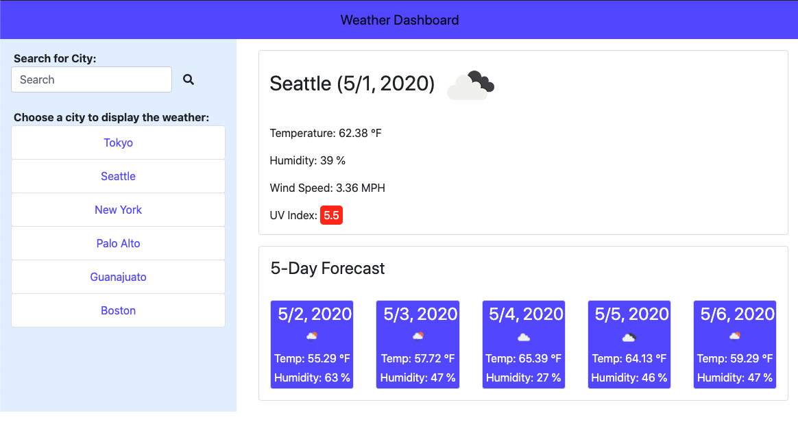

# Weather Dashboard

Application URL: https://nobobobo.github.io/weather-dashboard/

## Introduction


This application shows the current weather and 5-day forecast of the city from the user chooses.

## How it works

* This application using Ajax method and OpenWeather API to fetch current weather and future-forecast of the city as below: 

```
// APIs from https://openweathermap.org/api

$.ajax({
        url: "https://api.openweathermap.org/data/2.5/weather?q=Seattle&units=imperial&appid=..."
        method: "GET"
    }).then(<a function>)
```
* The User can type into input form the search the city.

* Once the User has chosen the city to display its weather, the city is stored to the city list that stays at localstorage.

* By clicking a city from the city list, the application will rerender the weather and 5 day forecast of that city. 
